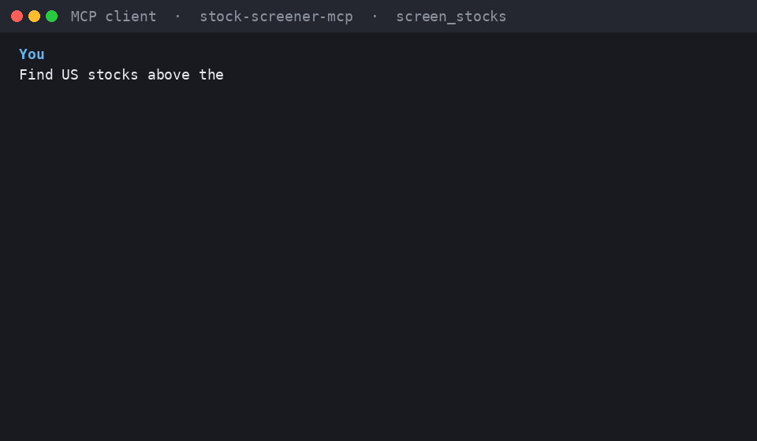

# stock-screener-mcp — TradingView Stock Screener for AI Agents

An open-source [MCP](https://modelcontextprotocol.io) server that lets Claude, Cursor, VS Code and other MCP clients screen global stocks using 135 TradingView fields across fundamentals, technicals, momentum, volume, valuation and more.

**135 TradingView fields. One MCP tool.**

[](LICENSE)
[](pyproject.toml)
[](https://modelcontextprotocol.io)



*Rendered from a real screen result (public data, 2026-09-02); [docs/demo-script.md](docs/demo-script.md) has the prompt, expected call, and steps to record a GUI client.*

## What can I ask?

Once connected, ask your AI client in plain language:

- "Find US stocks above their 200-day EMA, with RSI below 40, market cap above $2B, and relative volume above 1.5. Return the top 20 by traded value."
- "Find oversold large-cap US stocks."
- "Find stocks where EMA20 > EMA50 > EMA200."
- "Find high-volume Italian stocks with RSI below 35."
- "Find stocks crossing above their 200-day EMA."
- "Find high-relative-volume stocks with bullish TradingView technical ratings."

Every one of these was executed against the live screener while writing this page.

## 60-second quick start

**Prerequisites:** [uv](https://docs.astral.sh/uv/) (`curl -LsSf https://astral.sh/uv/install.sh | sh`). uv fetches Python 3.11+ for you. No TradingView account needed.

**1. Add the server to your client.** Claude Desktop (`claude_desktop_config.json`), Cursor (`.cursor/mcp.json`):

```json
{
  "mcpServers": {
    "stock-screener-mcp": {
      "command": "uvx",
      "args": ["--from", "git+https://github.com/xabbai/stock-screener-mcp", "stock-screener-mcp", "--transport", "stdio"]
    }
  }
}
```

Claude Code:

```bash
claude mcp add stock-screener-mcp -- uvx --from git+https://github.com/xabbai/stock-screener-mcp stock-screener-mcp --transport stdio
```

VS Code and HTTP setups: [docs/client-configs.md](docs/client-configs.md).

**2. Restart the client and ask:**

> Find US stocks above their 200-day EMA, with RSI below 40, market cap above $2B, and relative volume above 1.5. Return the top 20 by traded value.

**3. Expected result** — the client calls `screen_stocks` and you get a ranked table like this (sample from 2026-09-02, values change intraday):

| name | close | RSI | EMA200 | market cap | rel. volume | value traded |
|------|------:|----:|-------:|-----------:|------------:|-------------:|
| HWM | 254.89 | 37.3 | 245.73 | 101.7B | 1.93 | 1.41B |
| CSX | 48.70 | 35.8 | 44.16 | 90.2B | 1.80 | 777M |
| GD | 369.41 | 36.9 | 353.55 | 99.9B | 1.54 | 469M |

A fresh install to first result takes well under a minute (measured: 3 s in a clean virtual environment, see [docs/launch-audit.md](docs/launch-audit.md)).

## Features

- **135 fields, 19 categories** — trend, momentum, volatility, volume, ratings, price, valuation, profitability, growth, balance sheet, quality scores, performance, price extremes, gaps, dividends, ETF/fund, IPO, advanced technicals, candlestick patterns. [Full reference](docs/field-reference.md).
- **Any TradingView market** — `america` by default; pass `["germany"]`, `["italy"]`, or several markets for a global scan.
- **AND / OR filter trees** — 24 operators including `crosses_above`, `in_range`, `above%`, and field-to-field comparisons (`close > EMA200`).
- **Sorting and pagination** — any field, `asc`/`desc`, `limit` up to 500, `offset`.
- **Helpful errors** — unknown field names get case-insensitive and fuzzy suggestions.
- **stdio and Streamable HTTP** transports; one console script, no config file required.
- **Optional authenticated data** via your own TradingView browser session, off by default unless you install the extra.

## How it works

Natural language in your client becomes one tool call:

```json
{
  "filters": [
    {"left": "close", "op": "greater", "right": "EMA200"},
    {"left": "RSI", "op": "less", "right": 40},
    {"left": "market_cap_basic", "op": "greater", "right": 2000000000},
    {"left": "relative_volume_10d_calc", "op": "greater", "right": 1.5}
  ],
  "columns": ["name", "close", "RSI", "EMA200", "market_cap_basic", "relative_volume_10d_calc", "Value.Traded"],
  "markets": ["america"],
  "sort_by": "Value.Traded",
  "sort_order": "desc",
  "nulls_first": false,
  "limit": 20,
  "offset": 0,
  "language": "en"
}
```

and returns a compact JSON payload:

```json
{
  "total_count": 38,
  "columns": ["name", "close", "RSI", "EMA200", "market_cap_basic", "relative_volume_10d_calc", "Value.Traded"],
  "rows": [
    {"ticker": "NYSE:HWM", "name": "HWM", "close": 254.89, "RSI": 37.30, "EMA200": 245.73,
     "market_cap_basic": 101650485439.14, "relative_volume_10d_calc": 1.93, "Value.Traded": 1412620516.31}
  ],
  "market_context": {"markets": ["america"], "url": "https://scanner.tradingview.com/america/scan"},
  "sort": {"by": "Value.Traded", "order": "desc", "nulls_first": false},
  "range": {"offset": 0, "limit": 20}
}
```

OR logic and nesting:

```json
{"logic": "or", "conditions": [
  {"left": "RSI", "op": "less", "right": 30},
  {"logic": "and", "conditions": [
    {"left": "close", "op": "greater", "right": "EMA200"},
    {"left": "ADX", "op": "greater", "right": 25}
  ]}
]}
```

All nine parameters are required by the tool schema; pass `[]` or `""` to use defaults (`columns` → `name, close, volume, market_cap_basic`; `markets` → `["america"]`; `sort_by` → `Value.Traded`).

## Installation

**One command (no checkout):**

```bash
uvx --from git+https://github.com/xabbai/stock-screener-mcp stock-screener-mcp --transport stdio
```

**From source (contributors):**

```bash
git clone https://github.com/xabbai/stock-screener-mcp.git
cd stock-screener-mcp
uv sync --extra test          # or: pip install -e ".[test]"
uv run pytest -m "not network"
uv run stock-screener-mcp --transport stdio
```

**Optional authenticated data:** install the `cookies` extra (`uv sync --extra cookies` or `pip install -e ".[cookies]"`), log in to TradingView in Chrome, and the server reads that session's cookies in memory for each query. See [Live data](#live-data-optional).

## Configuration

`stock-screener-mcp` works without any configuration. Precedence is command-line flags → `config.json` → built-in defaults (`streamable-http` on `127.0.0.1:8000`).

| Flag | Description |
|------|-------------|
| `--transport {stdio,streamable-http}` | `stdio` for clients that launch the server as a subprocess (most desktop clients); `streamable-http` to serve `http://HOST:PORT/mcp` |
| `--host`, `--port` | HTTP bind address (`streamable-http` only) |
| `--config PATH` | JSON file: `{"transport": "stdio"}` or `{"transport": "streamable-http", "http": {"host": "127.0.0.1", "port": 8000}}` |

| Environment variable | Description |
|----------------------|-------------|
| `STOCK_SCREENER_MCP_CONFIG` | Path to `config.json` (overridden by `--config`) |
| `STOCK_SCREENER_MCP_BROWSER_COOKIES` | `auto` (default): use Chrome cookies if the `cookies` extra is installed; `off`: public data only; `on`: require cookies, fail loudly if unavailable |

**Transports:** `stdio` is the simplest local path and what every client config above uses. `streamable-http` is for running the server once and connecting several clients or containers: `stock-screener-mcp --transport streamable-http --port 8000` → `http://127.0.0.1:8000/mcp`.

## Field reference

Use exact TradingView field names in `columns`, `filters` and `sort_by`. The complete list with types, units and descriptions is generated from the code: **[docs/field-reference.md](docs/field-reference.md)**. Category overview:

| Category | Examples |
|----------|----------|
| Trend | `EMA20`, `EMA50`, `EMA200`, `ADX`, `Ichimoku.BLine` |
| Momentum | `RSI`, `CCI20`, `AO`, `Stoch.K`, `Stoch.D` |
| Volatility | `ATR`, `BB.upper`, `BB.lower`, `DonchCh20.Upper`, `DonchCh20.Lower` |
| Volume & flow | `volume`, `relative_volume_10d_calc`, `average_volume_30d_calc`, `ChaikinMoneyFlow` |
| Ratings | `Recommend.All`, `Recommend.MA`, `Recommend.Other` |
| Price | `close`, `open`, `high`, `low`, `change`, `market_cap_basic`, `Value.Traded` |
| Valuation | `price_earnings_ttm`, `price_book_ratio`, `price_sales_ratio`, `enterprise_value_ebitda_ttm` |
| Profitability & growth | `earnings_per_share_diluted_ttm`, `gross_margin_ttm`, `total_revenue_yoy_growth_ttm` |
| Balance sheet & quality | `debt_to_equity`, `current_ratio`, `piotroski_f_score_ttm`, `altman_z_score_ttm` |
| Performance | `Perf.W`, `Perf.1M`, `Perf.YTD`, `Perf.Y`, `Perf.5Y` |
| Price extremes & gaps | `price_52_week_high`, `High.All`, `gap`, `premarket_gap` |
| Dividends, ETF, IPO | `dividend_yield_recent`, `aum`, `expense_ratio`, `ipo_offer_date` |
| Advanced technical | `W.R`, `UO`, `KltChnl.upper`, `P.SAR`, `HullMA20`, `VWMA` |
| Candlestick patterns | `Candle.Doji`, `Candle.Engulfing.Bullish`, `Candle.Hammer`, `Candle.MorningStar` |

Operators: `greater`, `egreater`, `less`, `eless`, `equal`, `nequal`, `in_range`, `not_in_range`, `above%`, `below%`, `in_range%`, `not_in_range%`, `crosses`, `crosses_above`, `crosses_below`, `has`, `has_none_of`, `match`, `nmatch`, `empty`, `nempty`, `in_day_range`, `in_week_range`, `in_month_range`.

## Live data (optional)

By default stock-screener-mcp queries TradingView's public screener, which is delayed for some exchanges. With the `cookies` extra installed and `STOCK_SCREENER_MCP_BROWSER_COOKIES` unset or `auto`, the server reads your Chrome browser's `tradingview.com` cookies on each query and requests data as your logged-in user. Cookies are held in memory only and never written to disk or logs. Set `STOCK_SCREENER_MCP_BROWSER_COOKIES=off` to disable, or `on` to fail instead of silently falling back.

## Limitations and disclaimers

- **Not affiliated with TradingView.** stock-screener-mcp uses the community [`tradingview-screener`](https://github.com/shner-elmo/TradingView-Screener) library, which relies on an undocumented TradingView endpoint. Field names, limits and availability can change without notice, and your use is subject to TradingView's terms of service.
- **No accuracy claim, no liability.** The maintainer does not claim that any data returned is correct, complete, or up to date, and cannot be held liable for wrong, delayed, or missing data returned by this tool or by TradingView. Use at your own risk; nothing here is investment advice. Full text: [DISCLAIMER.md](DISCLAIMER.md).
- Screeners return the current state only: no historical time series, backtesting, streaming, alerts, or order execution.
- Some fields are only populated for specific instrument types (ETF, IPO) or markets.

## Troubleshooting

| Symptom | Fix |
|---------|-----|
| Client shows no `screen_stocks` tool | Run the exact `command` + `args` from your config in a terminal; the server must start with `--transport stdio` for subprocess clients. Restart the client after editing config. |
| `uvx: command not found` | Install uv and restart the client so it inherits the updated `PATH`. |
| `No module named 'mcp.server.fastmcp'` | An old install resolved `mcp` 2.x. Reinstall; stock-screener-mcp pins `mcp<2`. |
| `Unsupported field 'X'. Did you mean: …` | Use the exact name from [docs/field-reference.md](docs/field-reference.md); names are case-sensitive. |
| Empty `rows` | Loosen filters; screens run live and results change during the session. |
| `STOCK_SCREENER_MCP_BROWSER_COOKIES=on` error | Install the `cookies` extra and log in to TradingView in Chrome. |

## Contributing and security

Bug reports and pull requests are welcome — see [CONTRIBUTING.md](CONTRIBUTING.md). Please report vulnerabilities privately as described in [SECURITY.md](SECURITY.md), not in public issues. This project follows the [Contributor Covenant](CODE_OF_CONDUCT.md).

## License

MIT — see [LICENSE](LICENSE).
